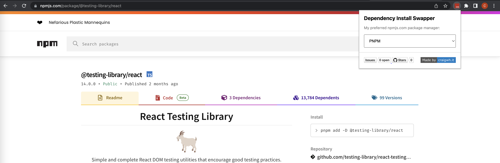

# Dependency Install Swapper

Lightweight google chrome extension which changes the install field in npmjs.com to your preferred package manager.



## Want to raise a bug or suggestion?

Please be patient with these and add as much detail as you can, for bugs add the wrong behavior and the proper behavior in a BDD structure if possible.

Suggestions are also appreciated heavily and please again give good detail with these, also feel free to raise pull requests.

- [Use this form for raising bugs/suggestions](https://github.com/craigwh10/dependency_install_swapper/issues/new)

## Development information

This section contains detail on how you run this application locally, as well as how you get it to show as an extension in your browser and interface with npmjs.com pages.

### Running locally

```sh
$ yarn
$ yarn run:js start
```

### Running in "production"

```sh
$ yarn
$ yarn run:js build
```

Then once the `output` directory is generated:

- Go to `chrome://extensions`
- Load unpacked pointing at `packages/javascript/output`
- Then you should see the extension

### Notes

- Using commit-lint standards for changelog generation, so use type(scope): msg.
- For current active requirements see [scenarios.md](./docs/scenarios.md) (used for manual test due to beyond unit test issues)

## Milestones

- [x] Converting npm to yarn commands in npm website.
- [x] Adding pnpm support.
- [x] Controlled via a toggle on the popup.
- [x] Improve styling of the popup
- [x] Infer dev dependencies based on existence of command in readme
  - [x] With warning on missing readme detail
  - [x] No warning if readme contains regular install
- [x] Added bower support
- [x] Ensure popup meets accessibility criteria
- [ ] Removing logs from deploy

## Tech tasks

- [x] Path aliases with parcel and tsc
- [ ] Linting
- [ ] Publishing with semver and generating distribution zips
- [ ] Automated compatibility coverage
  - [ ] Requires help, tried puppeteer, cypress & playwright without much success with regards to testing extensions on manifest v3 appropriately.
